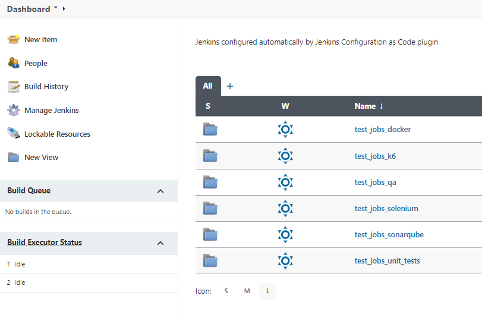

This project is a starter kit for setting up a Jenkins docker installation on Windows and related CI/CD and QA utilities  

Tools integrated:

* [Jenkins](https://www.jenkins.io/)
* [Jenkins Configuration as Code](https://www.jenkins.io/projects/jcasc/)
* [Jenkins plugins](https://plugins.jenkins.io/)
* [Docker](https://www.docker.com/)
* [SonarQube](https://www.sonarqube.org/)
* [xUnit.Net](https://xunit.net/)
* [Selenium](https://www.selenium.dev/)
* [k6](https://k6.io/)


# jenkins folder

* Dockerfile for building a custom Docker Image (built on top of the official one)  
*Note: this image relaxes some [CSP](https://content-security-policy.com/) to correctly visualize k6 HTML report.  
If you do not need it, remove the JAVA_OPTS customization relative to hudson.model.DirectoryBrowserSupport.CSP parameter.*
* Configuration by [Configuration as Code](https://https://plugins.jenkins.io/configuration-as-code/) plugin
* Prepopulated with test jobs (remember to [approve](https://stackoverflow.com/a/45771737/1966366) scripts before runnig them otherwise they'll fail)
* Different test jobs, described afterwards
  


## Test job folder *docker*:
* default-agent
* docker-agent
* push_image_to_local_registry
* docker-agent-from-local-registry (first run a local registry)

## Test job folder *sonarqube*:
* 01_build_netcore_sonarscanner_image_and_push_to_local_registry  
    Builds a netcore image with java & sonarscanner already installed and puh it to local registry
* 02_sonarscanner-in-docker-agent  
    Example of integrating jenkins - netcore - sonarqube   
    Before running this job:
    * In Sonarqube:   create a token for admin user  
    http://localhost:9000, user: admin, password: admin  
    Go to: Administration -> Security -> Users -> "Administrator" Tokens
    * In jenkins: config sonarqube credential.  
    JCasC has alreadfdy provisioned a placeholder sonarqube token, just update its password  with the token just created.  
    Go to  Manage Jenkins -> Manage Credentials -> sonarqube-token-admin -> Update -> Change Password

    After running this job login to sonarqube http://localhost:9000 and you'll see:
    * Static code analysis
    * Code coverage
    * Test results

* 03_sonarscanner-in-docker-agent-netcore-scanner  
  Like the job before but faster.  
This job uses a docker agent pre-configured for scanning net core projects.  
  Before running this job run the job 01_build_netcore_sonarscanner_image_and_push_to_local_registry which builds the net core sonarqube scanner and pushes it to local registry

If you run second or third job, you will end up with these results in sonarqube:


## Test job folder *selenium*:

* a pipeline running a basic grid (3 browsers) and xunit UI tests against this grid

*Note:* seleniumhub is automatically run on demand by the jenkins job

You can follow tests progress pointing your browser to http://localhost:4444


## Test job folder *k6*:

* a pipeline running k6 load test and publishing HTML report
* a pipeline running k6 load test and publishing k6 metrics to grafana
Before running this job issue:
    
    docker compose -f k6/docker-compose.yaml up
    
# Project *registry* folder

* running a local (insecure) registry for hosting custom images (used as agent from jenkins)

# Porject *sonarqube* folder

* running a sonarqube server
    Plese be sure to meet [Docker Host Requirements](https://hub.docker.com/_/sonarqube)  
    ```
    sysctl -w vm.max_map_count=524288
    sysctl -w fs.file-max=131072
    ulimit -n 131072
    ulimit -u 8192
    ```

* Dockerfile for creating a sonarqube netcore scanner for using as docker agent 

# Project *selenium* folder

* a docker-compose.yml file for setting up a basic selenium grid
* a xUnit project for testing the grid

# Project *k6* folder

* a docker-compose.yml file for setting up influxdb:1.8 and grafana with a pre-provisioned dashboard for visualizing k6 load test results (take from [k6 repo](https://github.com/grafana/k6))
* an example k6 load test also optionally generating HTML results (thank to [k6-reporter](https://github.com/benc-uk/k6-reporter) project )

# docker compose

Project ships with some docker compose files for bringing up main parts of the system

* /docker-compose.yml  
  Brings up the core infrastructure: 
    * jenkins
    * registry

* /sonarqube/docker-compose.yml  
  Brings up the sonarqube infrastructure
    * postregs database
    * sonarqube server

* /selenium/docker-compose.yml  
  Brings up the selnium infrastructure
    * selenium-hub
    * chrome node
    * firefox node
    * edge node

* /k6/docker-compose.yml  
  Brings up the grafana infrastructure
    * influxdb:1.8
    * grafana with pre-provisioned dashboards
  
If you want the full system up&running with just one command you can issue:

    docker compose -f .\docker-compose.yaml -f .\sonarqube\docker-compose.yaml -f .\k6\docker-compose.yaml up

You should see this result:


and of course to clean everything:

    docker compose -f .\docker-compose.yaml -f .\sonarqube\docker-compose.yaml -f .\k6\docker-compose.yaml down -v

*Note:* seleniumhub is outside this command because it is run on demand by the jenkins job