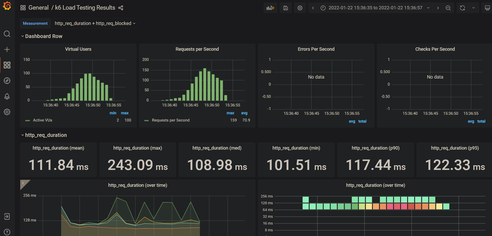
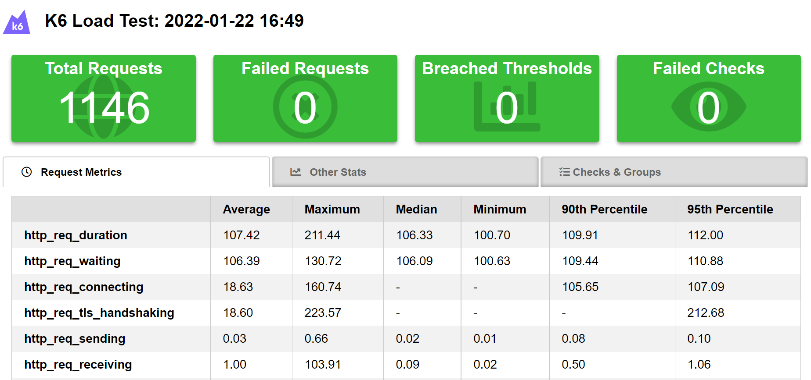
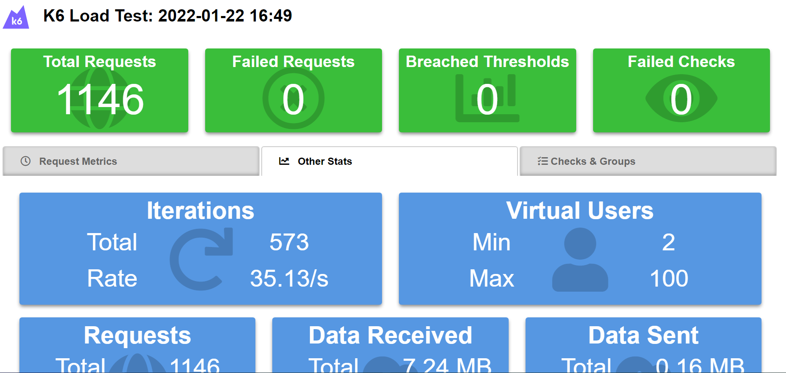

# k6 Basic commands

Unix

    run -i loadimpact/k6 run - <load_tests.js

Unix & Powershell

    cat load_tests.js | docker run -i loadimpact/k6 run -

## providing more options

You can specify options in test file. Here is an example if you wat to pass them by command line

    cat load_tests.js | docker run -i loadimpact/k6 run --vus 10 --duration 30s -

## Getting tests output

Note, mounting local folder also mounts load tests => no more redirections needed

    docker run --rm -i -v ${PWD}:/work loadimpact/k6 run --out json=/work/k6-test-results.json /work/load_tests.js

## Generating HTML report

Provided test script also can also generate and HTML report if you provide an environment variable K6_TEST_RESULTS_HTML_FULL_FILE_PATH containing the destination report path. Thanks to [this project](https://github.com/benc-uk/k6-reporter)

    docker run --rm -i -e K6_TEST_RESULTS_HTML_FULL_FILE_PATH="/work/summary.html" -v ${PWD}:/work loadimpact/k6 run --out json=/work/k6-test-results.json /work/load_tests.js
## loggin into the container

    docker run --rm -it --entrypoint sh loadimpact/k6

# Report results: granfana + influxdb (1.8)

refs - https://k6.io/blog/k6-loves-grafana/

    docker compose up
    cat load_tests.js | docker run --rm -i loadimpact/k6 run -o influxdb=http://host.docker.internal:8087/k6 -

docker compose makes:
* runs influxdb:1.8
* runs grafana with
    * a pre-provisioned datasource poiting to influxdb
    * a [pre-provisioned dashboard](https://grafana.com/grafana/dashboards/2587) using that datasource

If you browse to the dashboard from Grafana ("Dashboards" -> "Browse" -> "k6 Load Testing Results") after you run the load test, you will see the dashboard populate

*Note on influxdb 1.8:*

k6 still not support exporting data to influxdb:2.0  

*Note on preprovisioning dashboards in grafana:*

Due to [this issue](https://github.com/grafana/grafana/issues/10786) it is not still possible in grafana provisioning dashboard with variables.  
So I modified the [k6 dashbord](https://grafana.com/grafana/dashboards/2587) replacing "${DS_K6}" with the provisioned datasource UID:  "influxdb-k6-uid"   

# Report results: jenkins + HTML publisher

Thanks to [k6-reporter](https://github.com/benc-uk/k6-reporter) project one Jenkins job is configured for publishing results as HTML

The result is something like this:

and

